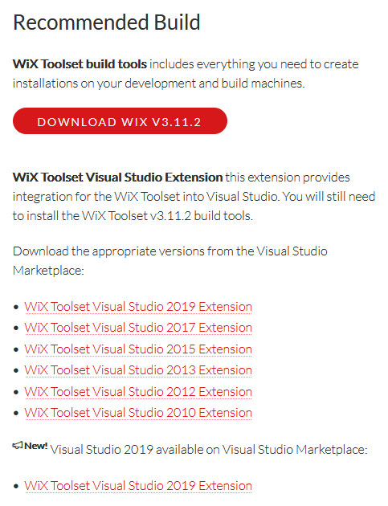
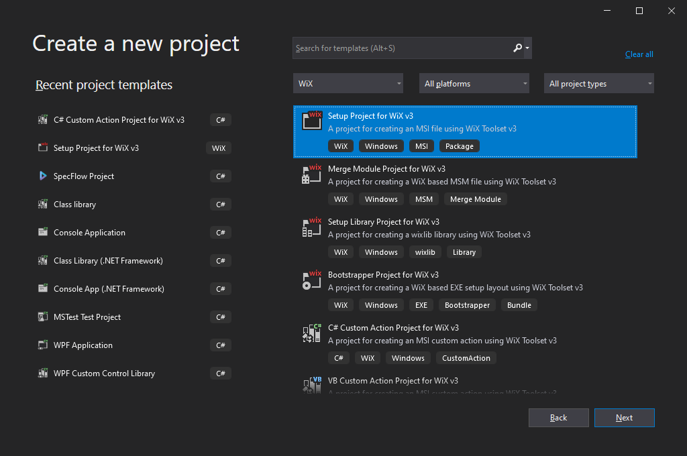

# Deploy Files

In this tutorial we will:

- Create a new WiX Project.
- Configure a directory structure to be created on the target machine when installer is run.
- Provide a text file to be deployed in the target directory.

## Prerequisites

Before anything, WiX Toolset must be installed and integrated with Visual Studio.

Install **WiX Toolset build tools** and the **Visual Studio extension** from `https://wixtoolset.org/releases/`:



## Step 1: Create a new WiX project

In Visual Studio create a new "Setup Project for WiX v3" project:



The template contains a single `Product.wxs` file that is, actually an xml file. This file contains the description for the MSI that we want to create.

When we open the file we find:

- A `<Product>` tag that contains the description of the product;
- A `<Fragment>` tag that contains the directory structure we want to be created by the MSI at install time;
- A second `<Fragment>` tag that contains the list of components that the MSI will install;

```xml
<?xml version="1.0" encoding="UTF-8"?>
<Wix xmlns="http://schemas.microsoft.com/wix/2006/wi">
	<Product ...>
		...
	</Product>

	<Fragment>
		<Directory ...
	</Fragment>

	<Fragment>
		<ComponentGroup ...
	</Fragment>
</Wix>
```

**Suggestion**: I strongly suggest to keep in this file only the `<Product>` tag and to extract the other two fragments into separate files. We'll discuss about this in details later in this tutorial.

## Step 2: The Product

The `<Product>` tag is the main section of the WiX project. When you read a WiX project, you should start from the `<Product>` tag.

The first aspects that may capture our attention are the name of the product and the manufacturer. They are provided as attributes of the `<Product>` element:

```xml
<Product Id="*" Name="Deploy Files - WiX Toolset Pill" Language="1033" Version="1.0.0.0"
         Manufacturer="Dust in the Wind" UpgradeCode="1005fc0e-c562-4498-9196-aa6fdd5f4e62">
    ...
</Product>
```

The version may also be interesting, but for the first installer we are creating, we will keep it at "1.0.0.0".

Some other xml tags are generated, but we may safely leave them, for now, as they are. No need to change them: `<Package>`, `<MajorUpgrade>`, `<MediaTemplate>`:

```xml
<Product Id="*" Name="Deploy Files - WiX Toolset Pill" Language="1033" Version="1.0.0.0"
         Manufacturer="Dust in the Wind" UpgradeCode="1005fc0e-c562-4498-9196-aa6fdd5f4e62">
    
    <Package InstallerVersion="200" Compressed="yes" InstallScope="perMachine" />

    <MajorUpgrade DowngradeErrorMessage="A newer version of [ProductName] is already installed." />
    <MediaTemplate />

    ...
</Product>
```

### The Features

The `<Feature>` tag, though, may need some explanation.

```xml
<Product Id="*" Name="Deploy Files - WiX Toolset Pill" Language="1033" Version="1.0.0.0"
         Manufacturer="Dust in the Wind" UpgradeCode="1005fc0e-c562-4498-9196-aa6fdd5f4e62">

    ...

    <Feature Id="ProductFeature" Title="DeployFiles" Level="1">
        <ComponentGroupRef Id="FileComponents" />
    </Feature>

</Product>
```

A `<Feature>` element may pack multiple components that are installed together as a logical unit. If the installer has a UI, the user can select independently the features that wants to be installed. the `Title` attribute contains the text displayed in the UI for the feature.

A feature is the smallest unit that the user can decide to install or not. For example, we may want to have a mandatory feature that installs the application itself and other optional features that installs language packs.

The current installer has only one feature and no UI. The only feature will be automatically installed.

**Note**: The `Level` attribute should be set to 1 to enable the installation of the feature by default.

### Components

If we talked about features it's only fair to say a few words about components.

They are the smallest unit managed and tracked by the installer. It is suggested to create one component for each file that needs to be installed. A feature may contain multiple components and can easily handle hundreds or thousands of components.

Components can exist individually or grouped in a `<ComponentGroup>`. Also they can be added directly into the `<Feature>` tag or created in a separate file and added as a reference.

**Suggestion**: I suggest grouping components using `<ComponentGroup>` and move them in separate files with a suggestive name to easily understand what it contains. Then add the component group into the `<Feature>` tag as a reference as it is shown in the above example with the `FileComponents`. We'll describe the `FileComponents` later in this tutorial.

## Step 3: Define the directory structure

Next, let's describe the directory structure that we need to be created on the target machine, when the installer is executed.

**Suggestion**: To improve the readability of the WiX file, I consider a good practice to define the installation directories in a separate file. For this, we will create a new wxs file and move the entire `<Fragment>` containing the directory structure into this file.

```xml
<?xml version="1.0" encoding="UTF-8"?>
<Wix xmlns="http://schemas.microsoft.com/wix/2006/wi">
    <Fragment>

        <Directory Id="TARGETDIR" Name="SourceDir">
            <Directory Id="ProgramFilesFolder">
                <Directory Id="ManufacturerFolder" Name="Dust in the Wind">
                    <Directory Id="INSTALLFOLDER" Name="Deploy Files - WiX Toolset Pill" />
                </Directory>
            </Directory>
        </Directory>

    </Fragment>
</Wix>
```

**Note**: The `<Wix>` element must be kept as the root element in this file, too.

The element with the id `TARGETDIR` is required by the Windows Installer and is the root of all directory structures of the installation. Every WiX project will have this directory element.

Next directory is the one having the `ProgramFilesFolder` id. It has no name. The actual name is provided by the Windows operating system at install time.

Next we may add other custom directories. In this tutorial we added the `Dust in the Wind` directory that can be referenced in the installer by the `ManufacturerFolder` id.

The `INSTALLFOLDER` is another important directory. This is considered the root directory where the product will be installed.

**Important**: Just by specifying the directories here, the installer will not really create them empty on the disk. Only files are created by the installer. We need to describe the directory hierarchy here only to be able to reference them later, by id, when we configure the files. See the next step.

**Suggestion**: Even if WiX does allow it, I suggest to never add files directly in this structure. I prefer to keep this structure short, clean and easy to understand. The files will be configured later in another wxs file and will reference these directories by id.

## Step 4: Add files

TBD
